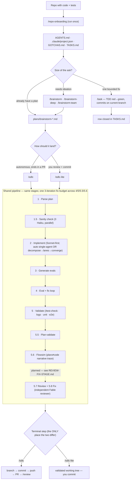

# Flow: how brainstorm-toolkit works

One visual reference for the whole toolkit, across all three agents (Claude Code, GitHub Copilot,
OpenAI Codex). The toolkit assumes you **start in a repo that already has code and tests** — it is
not a project scaffolder. Per-tool prose guides used to live in `FLOW-CLAUDE-CODE.md` /
`FLOW-COPILOT.md` / `FLOW-CODEX.md`; this file replaces all three.

## Install

```bash
# Plugin marketplace (Claude Code, once public):  /plugin marketplace add <repo> ; /plugin install brainstorm-toolkit
# File install (works today) — pick your agent(s):
bash setup.sh --target . --tools claude          # or: copilot | codex | both | all
```

`setup.sh` writes skills to `.claude/skills/` (Claude), `.github/skills/` (Copilot), and/or
`.agents/skills/` (Codex), plus `AGENTS.md` + `CLAUDE.md` (**copied**, not symlinked), `TASKS.md`,
and `.claude/project.json.example`. Every `project.json` key is optional — skills skip cleanly when
one is missing.

## The flow



Skill-repo mode (editing a plugin repo like this one) is **auto-detected** from
`.claude-plugin/marketplace.json` at the repo root: eval-driven stages self-substitute for
structural checks. No flag.

## Pick your entry skill

| Skill | Input | Terminal action | Use when |
|---|---|---|---|
| `/task <desc>` | ad-hoc ask | TDD red→green, **green commit** on current branch | a one-line fix, a small util, a rename — no evals/flowsim |
| `/sdlc-lite <plan \| task-id \| range \| desc>` | plan, task(s), or ask | full pipeline → **validated tree you commit** | full discipline on work you'll review + commit yourself (e.g. onto an open PR branch); `/sdlc-lite 1-5` runs a queue |
| `/sdlc <plan-file>` | plan file | full pipeline → **PR** | autonomous delivery with human review at the PR boundary |

`/sdlc` and `/sdlc-lite` run the **same pipeline**; only Stage 6 differs (PR vs hand-off). Ideate
first with `/brainstorm` (fast), `/brainstorm-deep` (ambiguous/high-stakes), or `/brainstorm-team`
(multi-agent product research).

## Same pipeline, three runtimes

| | **Claude Code** | **GitHub Copilot** | **OpenAI Codex** |
|---|---|---|---|
| Skills install to | `.claude/skills/` | `.github/skills/` | `.agents/skills/` |
| Pipeline execution | **prose by default; deterministic Workflow when `ultracode` is on** | sequential prose overlay | sequential prose overlay |
| Parallel sub-agents | yes (Agent tool + Workflow fan-out) | no — inline, sequential | no — inline, sequential |
| Plan mode | yes (`/brainstorm`) | no (linear overlay) | its own plan mode |
| `models.cap` ceiling | enforced per dispatch (`capModel()`) | advisory — set session model | advisory — set session model |

**Source of truth = the canonical prose** in `skills/<name>/SKILL.md`. The Claude-only Workflow
script (`skills/sdlc/workflows/sdlc-pipeline.workflow.js`) *mirrors* that prose; the `copilot/` and
`codex/` overlays are the cross-tool fallback. Change the prose first, then bring the Workflow and
overlays into line — the three-way-sync contract in [`../CLAUDE.md`](../CLAUDE.md).

## Model tiers

- **Fan-out is Sonnet-first.** `models.cap` in `project.json` (or per-run `--model <tier>`) is a
  **ceiling** — it only lowers dispatches above it (Opus→cap), never raises Haiku/Sonnet.
  `--model opus` opts a run up. Canonical spec: `skills/sdlc/templates/model-cap.md`.
- **Reviewer axis (planned).** The Review→Fix stage adds a *separate* reviewer model (default
  **Fable**), independent of the fan-out cap, with `--review-model <name>` and an Opus fallback when
  Fable isn't available. Design of record: [`REVIEW-FIX-STAGE.md`](REVIEW-FIX-STAGE.md).

## Utilities (any time)

`/status` (work queue) · `/gotcha` (log a project pitfall) · `/flowsim` (plan⇄code trace) ·
`/test-check` (run configured tests + log audit) · `/plan-html` (render a plan as shareable HTML) ·
`/repo-health` (read-only hygiene sweep) · `/dead-code-review` · `/review-pr`.

## Deeper references

- [`CONVENTIONS.md`](CONVENTIONS.md) — canonical naming: stage names, slugs, artifact IDs, flags (the contract every skill reads).
- [`REVIEW-FIX-STAGE.md`](REVIEW-FIX-STAGE.md) — the planned adversarial Review→Fix stage + reviewer-model axis.
- [`PHASE-1-STATE-ENVELOPE.md`](PHASE-1-STATE-ENVELOPE.md) — the `.claude/pipeline/<slug>/` state envelope design + deferred backlog.
- [`../AGENTS.md`](../AGENTS.md) — skill-authoring rules for contributors · [`../README.md`](../README.md) — install + full skills table.
